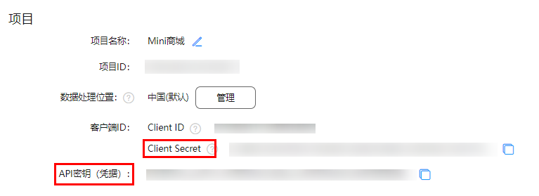

# 天气查询

### 简介

这是一个使用DevEco低代码能力和AppGallery Connect提供的低代码SDK能力构建的天气查询页面。效果图如下：

### 相关权限
网络权限

### 使用方式
1. 在[AppGallery Connect控制台](https:://developer.huawei.com/consumer/cn/service/josp/agc/index.html)下载agconnect-services.json文件，至entry/src/main/resources/rawfile目录下
   
2. 在[AppGallery Connect控制台](https:://developer.huawei.com/consumer/cn/service/josp/agc/index.html)复制如下值，并配置到entry/src/main/api/config下的对应位置。
   
3. 运行端侧工程，在应用中查看功能是否正常，功能说明见下

### 功能说明
1. 启动应用显示首页内容，包括“商品广告”、“今日天气”、“未来天气”、三个内容卡片。
2. “商品”卡片使用低代码SDK提供的数据模型批量查询接口agconnect.callConnector接口实现。
3. “未来天气”卡片使用低代码SDK提供的连接器SDK提供，对接心知天气：https://www.seniverse.com/api 批量查询天气数据。

### 约束与限制
暂无